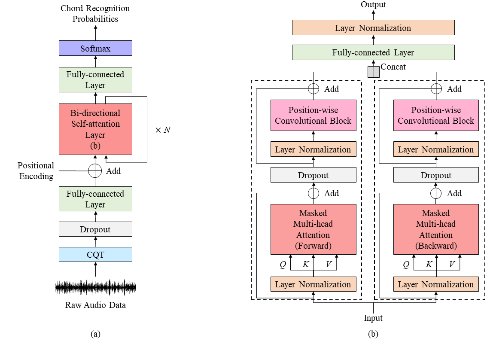
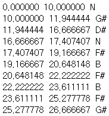
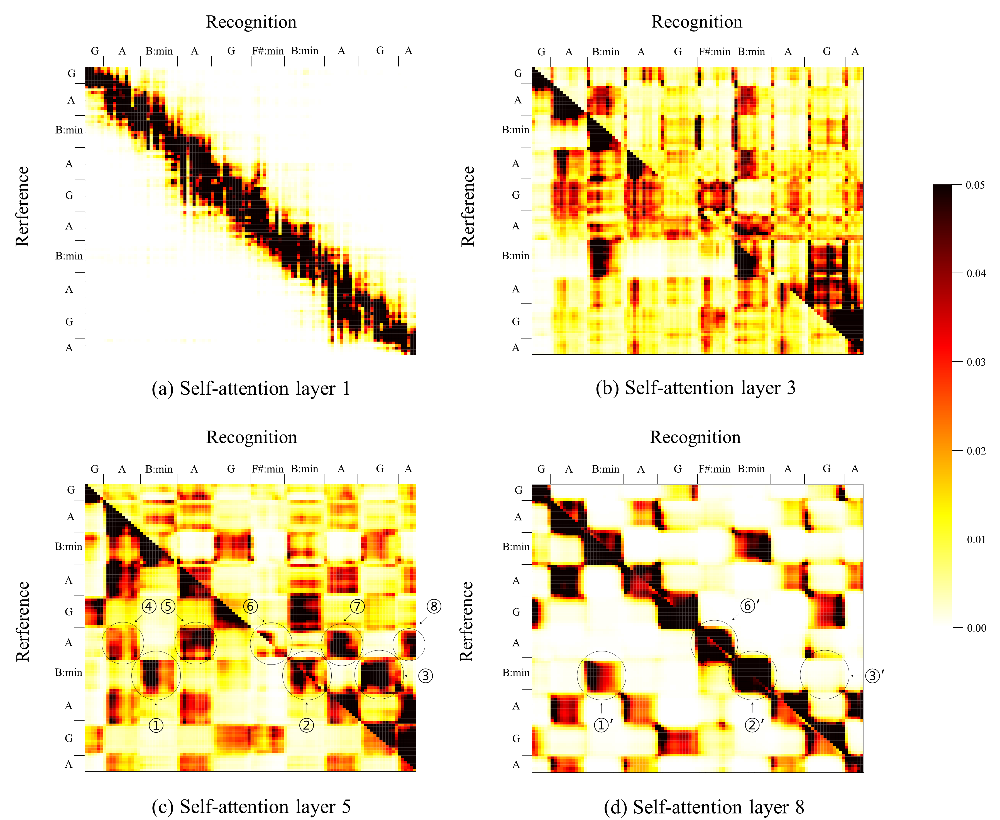

# A Bi-Directional Transformer for Musical Chord Recognition

This repository has the source codes for the paper "A Bi-Directional Transformer for Musical Chord Recognition"(ISMIR19).



## Requirements
- pytorch >= 1.0.0
- numpy >= 1.16.2
- pandas >= 0.24.1
- pyrubberband >= 0.3.0
- librosa >= 0.6.3
- pyyaml >= 3.13
- mir_eval >= 0.5
- pretty_midi >= 0.2.8

## File descriptions
  * `audio_dataset.py` : loads data and preprocesses label files to chord labels and mp3 files to constant-q transformation. 
  * `btc_model.py` : contains pytorch implementation of BTC.
  * `train.py` : for training. 
  * `crf_model.py` : contatins pytorch implementation of Conditional Random Fields (CRFs) .
  * `baseline_models.py` : contains the codes of baseline models.
  * `train_crf.py` : for training CRFs.  
  * `run_config.yaml` : includes hyper parameters and paths that are needed.
  * `test.py` : for recognizing chord from audio file. 

## Using BTC : Recognizing chords from files in audio directory

### Using BTC from command line
```bash 
$ python test.py --audio_dir audio_folder --save_dir save_folder --voca False
```
  * audio_dir : a folder of audio files for chord recognition (default: './test')
  * save_dir : a forder for saving recognition results (default: './test')
  * voca : False means major and minor label type, and True means large vocabulary label type (default: False)
  
The resulting files are lab files of the form shown below and midi files.

  

## Attention Map
The figures represent the probability values of the attention of self-attention layers 1, 3, 5 and 8 respectively. The
layers that best represent the different characteristics of each layers were chosen. The input audio is the song "Just A Girl"
(0m30s ~ 0m40s) by No Doubt from UsPop2002, which was in evaluation data.
  

## Data
We used Isophonics[1], Robbie Williams[2], UsPop2002[3] dataset which consists of chord label files. Due to copyright issue, these datasets do not include audio files. The audio files used in this work were collected from online music service providers.

[1] http://isophonics.net/datasets 

[2] B. Di Giorgi, M. Zanoni, A. Sarti, and S. Tubaro. Automatic
chord recognition based on the probabilistic
modeling of diatonic modal harmony. In Proc. of the
8th International Workshop on Multidimensional Systems,
Erlangen, Germany, 2013.

[3] https://github.com/tmc323/Chord-Annotations

## Reference
  * pytorch implementation of Transformer and Crf: https://github.com/kolloldas/torchnlp 

## Comments
  * Any comments for the codes are always welcome.

